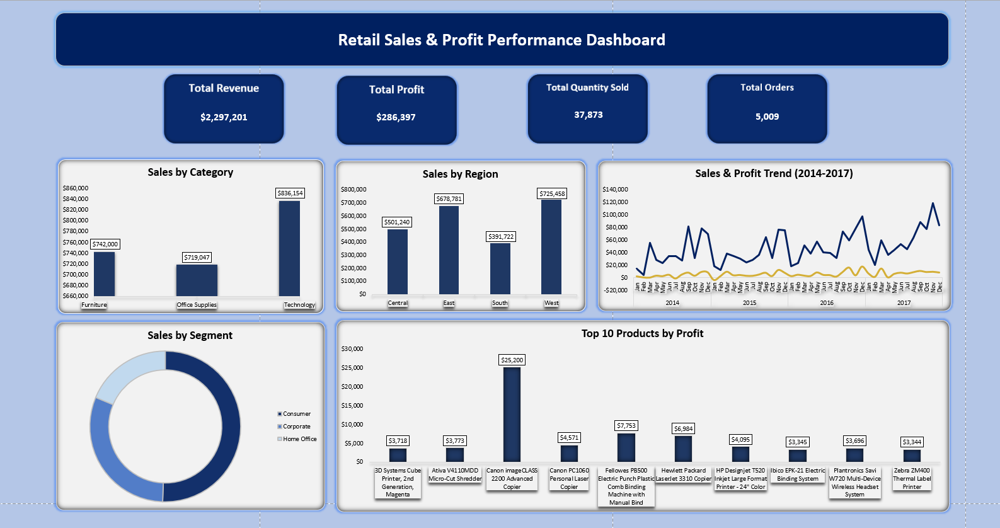
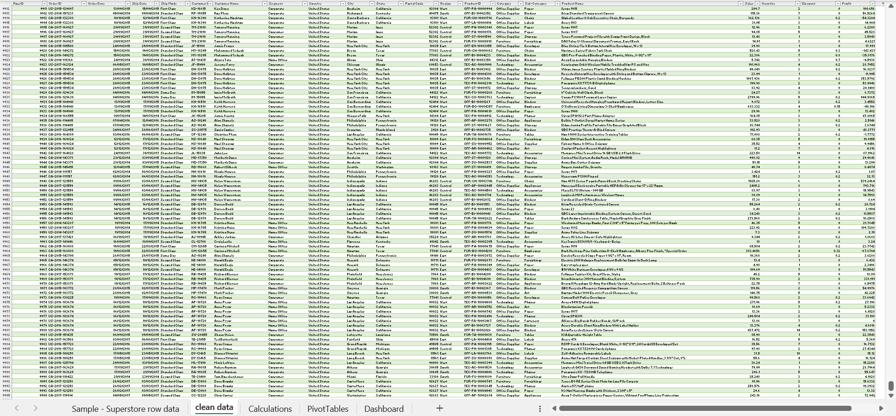
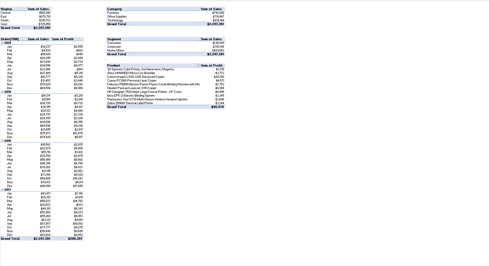

# Retail Sales & Profit Performance Dashboard (Excel)

An interactive Excel dashboard analyzing retail sales and profit performance, built from a real-world transactional dataset (9,994 orders, 2014–2017). The project covers the full analytics workflow: data cleaning, PivotTable analysis, chart design, and dashboard assembly.

##  Business Problem

A retail superstore needed a clear, at-a-glance view of its sales and profit performance across regions, product categories, customer segments, and time — to identify which parts of the business are driving revenue, which are underperforming on margin, and where opportunities exist to improve profitability.

##  Dataset

- **Source:** Sample Superstore Dataset (Kaggle)
- **Size:** 9,994 rows × 21 columns
- **Time period:** 2014–2017
- **Key fields:** Order Date, Region, Category, Sub-Category, Segment, Sales, Profit, Quantity, Discount

##  Data Cleaning

Before analysis, the raw dataset was checked and cleaned in Excel:
-  Checked for duplicate rows (none found)
-  Checked for blank/missing values (none found)
-  Converted Order Date and Ship Date from text to proper date format
-  Verified numeric fields (Sales, Profit, Quantity, Discount) were correctly typed
-  Verified category fields (Segment, Region, Category) had no spelling inconsistencies

##  Analysis (PivotTables)

Five PivotTables were built to summarize the cleaned data from different angles:

| PivotTable | Purpose |
|---|---|
| Region | Sales, Profit, and Order count by Region |
| Category | Sales, Profit, and Order count by Product Category |
| Order Date (Year/Month) | Monthly Sales & Profit trend, 2014–2017 |
| Segment | Sales, Profit, and Order count by Customer Segment |
| Top 10 Products | Top 10 products ranked by Profit |

##  Dashboard

The final dashboard combines four KPI summary cards with five charts, all built using PivotCharts linked to the underlying PivotTables.

**KPIs:**
- Total Revenue: $2,297,201
- Total Profit: $286,397
- Total Quantity Sold: 37,873
- Total Orders: 5,009 (unique orders, calculated using `UNIQUE()`/`COUNTA()`)

**Charts:**
1. Sales by Category (Column)
2. Sales by Region (Column)
3. Sales & Profit Trend, 2014–2017 (Line, dual-axis)
4. Sales by Segment (Doughnut)
5. Top 10 Products by Profit (Bar)

##  Key Insights

- **Furniture drives high revenue but low profit.** Despite the second-highest sales ($742K), Furniture generated the lowest profit ($18.5K) of the three categories — signaling a margin problem worth investigating (likely tied to high discounting).
- **Technology has the best profit efficiency.** With fewer orders (1,544) than Office Supplies (3,742), Technology generated the highest Sales and Profit — driven by higher-value items like copiers and printers.
- **West region leads on both Sales and Profit**, while **South has the fewest orders but outperforms Central on profit**, suggesting a smaller but more profitable customer base.
- **Consumer segment dominates order volume**, accounting for the largest share of both Sales and Profit among the three segments.
- **Revenue grew over the 2014–2017 period**, but Profit stayed comparatively flat — highlighting that top-line growth did not translate proportionally into bottom-line gains.

##  Tools & Techniques Used

- Excel Tables & structured references
- PivotTables & PivotCharts (Data Model)
- DAX-free Distinct Count via `UNIQUE()` / `COUNTA()`
- Text-to-Columns for date cleaning
- Dynamic KPI cards linked to calculated cells
- Custom color theming, data labels, and chart formatting

##  Files

- `Sales superstore dataset.xlsx` — full workbook (raw data, cleaned data, calculations, PivotTables, dashboard)
- `dashboard-preview.png` — full dashboard screenshot
- `kpi-summary.png` — KPI summary card
- `raw-data-preview.png` — raw dataset preview
- `pivottable-summary.png` — PivotTable summary preview

##  Next Steps / Limitations

- Add interactivity using Slicers connected across all PivotCharts
- Add Average Order Value and Profit Margin % as additional KPIs
- Recreate the same analysis in Power BI to compare workflows
